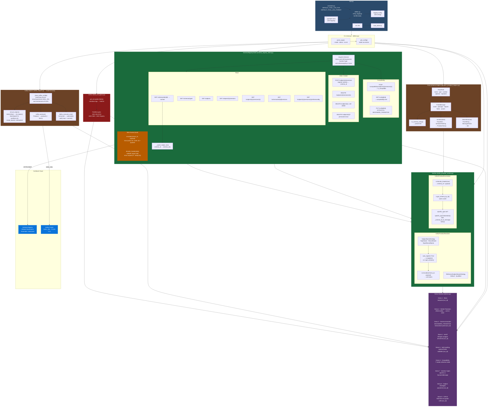

# Confluent Cloud Python Protobuf CSFLE Example
A hands-on Python demonstration of the **Confluent Cloud Protobuf Schema Serializer & Deserializer**, covering every major concept from the official [Confluent Protobuf SerDes documentation](https://docs.confluent.io/cloud/current/sr/fundamentals/serdes-develop/serdes-protobuf.html).

The project talks to a Confluent Cloud Schema Registry over the SR REST API and, when run in full mode, produces and consumes messages on a Kafka cluster via `confluent-kafka`. No `protoc` compiler or generated stubs are required — schemas are defined as Python dataclasses, compiled at runtime into `google.protobuf` `FileDescriptorProto` objects, and serialized to **Protobuf binary** using `google.protobuf.message_factory`.

---

## Project layout

```
cc-python-protobuf-csfle-example/
├── src
│   ├── constants.py                 # DEFAULT_TOOL_LOG_FILE, DEFAULT_TOOL_LOG_FORMAT
│   ├── utilities.py                 # setup_logging(), get_config(), parse_args() — logging, env config, CLI
│   ├── schema_registry_client.py    # SchemaRegistryClient — SR REST API wrapper + wire format
│   ├── kafka_protobuf_serdes.py     # KafkaProtobufSerializer & KafkaProtobufDeserializer
│   ├── kafka_helpers.py             # ensure_topics(), kafka_produce(), kafka_consume_one()
│   ├── dynamic_protobuf_helpers.py  # ProtoMessage & ProtoField — dynamic proto3 schema builders
│   ├── field_encryption.py          # FieldEncryptor & get_encrypted_fields() — AES-256-GCM CSFLE
│   ├── demos.py                     # All nine demo functions (demo_basic … demo_csfle)
│   └── main.py                      # Thin entry point — wires config, SR client, and demo dispatch
├── run-all-demos.sh                 # Shell script — authenticates via AWS SSO and runs all demos in full mode
├── pyproject.toml                   # Project metadata, dependencies, logging
├── uv.lock                          # Pinned dependency lockfile — commit this
├── .env                             # Credentials — NOT COMMITTED, loaded automatically by python-dotenv at startup
├── .gitignore                       # Ignore .env, .venv/, logs, __pycache__/, etc.
├── CHANGELOG.md                     # Changelog in Markdown format
├── CHANGELOG.pdf                    # Changelog in PDF format
├── KNOWNISSUES.md                   # Known issues in Markdown format
├── KNOWNISSUES.pdf                  # Known issues in PDF format
├── LICENSE.md                       # License in Markdown format
├── LICENSE.pdf                      # License in PDF format  
└── README.md                        # This file — project overview, setup instructions, and documentation of all core concepts and classes
```

## Architecture Overview


---

## Requirements

- **Python ≥ 3.13**
- **[uv](https://docs.astral.sh/uv/)** — package and project manager

### Install uv

```bash
# macOS / Linux
curl -LsSf https://astral.sh/uv/install.sh | sh

# or via Homebrew
brew install uv
```

---

## Setup

```bash
git clone <repo-url>
cd cc-python-protobuf-example

# Create .venv and install exact pinned versions from uv.lock
uv sync
```

`uv sync` reads both `pyproject.toml` and `uv.lock` and installs everything
into a local `.venv`. No manual `pip install` is needed.

### Dependencies

| Package | Minimum | Purpose |
|---|---|---|
| `boto3` | 1.38.0 | AWS KMS client for CSFLE DEK unwrapping |
| `confluent-kafka` | 2.13.2 | Producer, Consumer, AdminClient (required for `--mode full` only) |
| `cryptography` | 44.0.0 | AES-256-GCM encryption for Client-Side Field Level Encryption (CSFLE) |
| `protobuf` | 7.34.0 | `google.protobuf` runtime (available for real binary encoding) |
| `requests` | 2.32.5 | Schema Registry REST API calls |
| `python-dotenv` | 1.2.2 | Auto-loads `.env` via `load_dotenv()` at startup |
| `dotenv` | 0.9.9 | dotenv compatibility shim |

> `confluent-kafka` is imported inside a `try/except` at startup; if it is
> absent the app still runs normally in `--mode schema-only`.

---

## Configuration

Create a `.env` file in the project root (never commit it):

```dotenv
# Kafka cluster — only required for --mode full
BOOTSTRAP_SERVERS=pkc-xxxxx.us-east1.gcp.confluent.cloud:9092
KAFKA_API_KEY=your_kafka_api_key
KAFKA_API_SECRET=your_kafka_api_secret

# Schema Registry — always required
SCHEMA_REGISTRY_URL=https://psrc-xxxxx.us-east-2.aws.confluent.cloud
SR_API_KEY=your_sr_api_key
SR_API_SECRET=your_sr_api_secret

# AWS KMS — required for --demo csfle (or --demo all)
AWS_KMS_KEY_ARN=arn:aws:kms:us-east-1:123456789012:key/your-key-id
```

`python-dotenv` loads this automatically at module startup via `load_dotenv()`;
no `--env-file` flag is needed.

### Confluent Cloud prerequisites

| Resource | Minimum |
|---|---|
| Schema Registry | Stream Governance **Advanced** (required for DEK Registry / CSFLE) |
| SR API key | `DeveloperRead` + `DeveloperWrite` on Schema Registry |
| Kafka cluster | Any type — Basic, Standard, Dedicated, or Enterprise |
| Kafka API key | `DeveloperRead` + `DeveloperWrite` on the cluster |
| AWS KMS key | Symmetric encrypt/decrypt key — required for `--demo csfle` |
| AWS credentials | `boto3`-compatible auth (env vars, `~/.aws/credentials`, IAM role, or AWS SSO — see `run-all-demos.sh`) |

---

## Running the demos

```bash
# Schema Registry only — no Kafka cluster required
uv run python src/main.py --mode schema-only

# Full end-to-end: SR + Kafka produce/consume
uv run python src/main.py --mode full

# Run a single demo section
uv run python src/main.py --mode schema-only --demo evolution
uv run python src/main.py --mode full --demo oneof

# Pin a run-id to reuse existing topics/subjects across runs
uv run python src/main.py --mode full --run-id abc12345

# Run all demos in full mode with AWS SSO authentication
./run-all-demos.sh --profile=<SSO_PROFILE_NAME>
```

### `run-all-demos.sh` — One-command full run

The `run-all-demos.sh` script automates AWS SSO authentication and runs every
demo in `--mode full` with a single command:

```bash
./run-all-demos.sh --profile=<SSO_PROFILE_NAME>
```

It performs the following steps:
1. Validates the `--profile` argument
2. Authenticates via `aws sso login`
3. Exports temporary AWS credentials using `aws2-wrap`
4. Sets `AWS_REGION` from the profile's configured region
5. Runs `uv run python src/main.py --mode full --demo all`

**Prerequisites:** AWS CLI v2, `aws2-wrap` (`pip install aws2-wrap`), and a
configured AWS SSO profile with access to the KMS key.

### Did you notice I prepended `uv run` to `python`?
You maybe asking yourself why.  Well, `uv` is an incredibly fast Python package installer and dependency resolver, written in [**Rust**](https://github.blog/developer-skills/programming-languages-and-frameworks/why-rust-is-the-most-admired-language-among-developers/), and designed to seamlessly replace `pip`, `pipx`, `poetry`, `pyenv`, `twine`, `virtualenv`, and more in your workflows. By prefixing `uv run` to a command, you're ensuring that the command runs in an optimal Python environment.

Now, let's go a little deeper into the magic behind `uv run`:
- When you use it with a file ending in `.py` or an HTTP(S) URL, `uv` treats it as a script and runs it with a Python interpreter. In other words, `uv run file.py` is equivalent to `uv run python file.py`. If you're working with a URL, `uv` even downloads it temporarily to execute it. Any inline dependency metadata is installed into an isolated, temporary environment—meaning zero leftover mess! When used with `-`, the input will be read from `stdin`, and treated as a Python script.
- If used in a project directory, `uv` will automatically create or update the project environment before running the command.
- Outside of a project, if there's a virtual environment present in your current directory (or any parent directory), `uv` runs the command in that environment. If no environment is found, it uses the interpreter's environment.

So what does this mean when we put `uv run` before `python`? It means `uv` takes care of all the setup—fast and seamless—right in your local Docker container. If you think AI is magic, the work the folks at [Astral](https://astral.sh/) have done with `uv` is pure wizardry!

Curious to learn more about [Astral](https://astral.sh/)'s `uv`? Check these out:
- Documentation: Learn about [`uv`](https://docs.astral.sh/uv/).
- Video: [`uv` IS THE FUTURE OF PYTHON PACKING!](https://www.youtube.com/watch?v=8UuW8o4bHbw)

### CLI flags

| Flag | Choices | Default | Description |
|---|---|---|---|
| `--mode` | `schema-only`, `full` | `schema-only` | SR-only or full Kafka round-trip |
| `--demo` | `all` `basic` `delete` `evolution` `oneof` `null` `compat` `types` `strategies` `csfle` | `all` | Which section to run |
| `--run-id` | any string | random 8-char UUID prefix | Appended to every topic and subject name to prevent collisions across runs |

In `--mode full` the app calls `ensure_topics()` via `AdminClient` to pre-create all six required topics before any produce calls.  Confluent Cloud mandates `replication_factor=3`; existing topics are silently skipped.

---

## Demo sections

### Demo 1 — Basic Serializer & Deserializer (`--demo basic`)

Builds two `ProtoMessage` objects (`OtherRecord` and `MyRecord`), registers
them in dependency order (referenced schema first), and serializes a message
into the Confluent wire format. Prints the magic byte (`0x00`), schema ID, and
full hex payload. Deserializes back with `KafkaProtobufDeserializer` using
`specific_type=my_record`. In full mode the wire bytes are produced to and
consumed from Kafka.

**Topics:** `testproto-{run_id}`  
**Subjects:** `other-{run_id}.proto`, `testproto-{run_id}-value`

### Demo 2 — Reference-Deletion Protection (`--demo delete`)

Demonstrates that Schema Registry rejects deletion of a schema that is
referenced by another. Calls `referenced_by()` to show the dependency graph,
attempts to delete the leaf subject (expects a `RuntimeError`), then shows the
correct order: delete the referencing subject first, then the referenced one.

### Demo 3 — Schema Evolution (`--demo evolution`)

Registers a v1 `MyRecord` schema (`id`, `amount`), sets `BACKWARD_TRANSITIVE`
compatibility on the subject via `PUT /config/{subject}`, then registers v2
with an added `customer_id` field. Calls `test_compatibility()` before
registration to verify safety. In full mode, produces both schema versions to
the same topic and consumes them.

**Topics:** `transactions-proto-{run_id}`  
**Subjects:** `transactions-proto-{run_id}-value`

### Demo 4 — Multiple Event Types / `oneOf` (`--demo oneof`)

Builds four schemas: `Customer`, `Product`, `Order`, and an `AllTypes` wrapper
that holds all three under a `oneof oneof_type` field. Registers all four with
cross-schema references, then serializes and routes three heterogeneous events
(`customer`, `product`, `order`) through a single topic.

**Topics:** `all-events-{run_id}`  
**Subjects:** `Customer-{run_id}.proto`, `Product-{run_id}.proto`,
`Order-{run_id}.proto`, `all-events-{run_id}-value`

### Demo 5 — Null-Value Handling (`--demo null`)

Shows the recommended proto3 approach for nullable fields using the `optional` keyword on `ProtoField`. Serializes a partial record (name only) and a full record, then deserializes both. Also prints the pre-proto3 `google.protobuf.StringValue` wrapper alternative used with Confluent Connect's `wrapper.for.nullable=true` flag.

**Topics:** `nullables-{run_id}`

### Demo 6 — Compatibility Rules (`--demo compat`)

Fetches the SR global compatibility level via `GET /config` and prints a
reference table of all seven modes. Highlights the key Protobuf-vs-Avro
distinction: adding a new *message type* (not just a field) breaks FORWARD
compatibility, making `BACKWARD_TRANSITIVE` the recommended default.

### Demo 7 — Schema Types & Return Types (`--demo types`)

Calls `GET /schemas/types` to list which schema types your SR instance
supports, then prints a reference table mapping Avro / Protobuf / JSON Schema
to their specific and generic Python return types. Documents the Python
equivalents of the Java `specific.protobuf.value.type` and `derive.type`
config properties.

### Demo 8 — Subject Name Strategies (`--demo strategies`)

Registers the same `Payment` schema under all three subject name strategies
and prints the resulting subject name for each. Also documents both reference
subject name strategies.

| Strategy | Resulting subject |
|---|---|
| `TopicNameStrategy` | `payments-{run_id}-value` |
| `RecordNameStrategy` | `Payment` |
| `TopicRecordNameStrategy` | `payments-{run_id}-Payment` |
| `DefaultReferenceSubjectNameStrategy` | import path, e.g. `other.proto` |
| `QualifiedReferenceSubjectNameStrategy` | dotted form, e.g. `mypackage.myfile` |

### Demo 9 — Client-Side Field Level Encryption (`--demo csfle`)

Demonstrates Confluent CSFLE using AES-256-GCM field-level encryption with
AWS KMS. Registers a KEK in the DEK Registry, defines a `SensitiveRecord`
schema with PII fields (`ssn`, `email`), tags them via schema metadata, and
encrypts them before Protobuf serialization using `FieldEncryptor`. Shows
three views: original plaintext, deserialized without decryption (ciphertext
visible), and deserialized with decryption (plaintext restored). Requires
`AWS_KMS_KEY_ARN` and valid AWS credentials.

**Topics:** `csfle-{run_id}`
**Subjects:** `csfle-{run_id}-value`

---

## Core classes

### `SchemaRegistryClient` (`schema_registry_client.py`)

A `requests.Session`-based REST client covering the full SR API surface used
by the demos. Authenticates with HTTP Basic (SR API key/secret). Maintains an
in-process `_cache: dict[int, dict]` keyed by schema ID to avoid redundant
`GET /schemas/ids/{id}` round-trips. Also includes the `_read_varint()` helper
used by `decode_header()` to skip the message-index varint array.

| Method | HTTP endpoint |
|---|---|
| `get_types()` | `GET /schemas/types` |
| `get_subjects()` | `GET /subjects` |
| `get_versions(subject)` | `GET /subjects/{s}/versions` |
| `get_version(subject, version)` | `GET /subjects/{s}/versions/{v}` |
| `get_schema_by_id(id)` | `GET /schemas/ids/{id}` *(cached)* |
| `get_versions_for_schema(id)` | `GET /schemas/ids/{id}/versions` |
| `referenced_by(subject, version)` | `GET /subjects/{s}/versions/{v}/referencedby` |
| `register(subject, schema, ...)` | `POST /subjects/{s}/versions` |
| `create_dek(kek, subj, algo?, encrypted_key_material?)` | `POST /dek-registry/v1/keks/{name}/deks` |
| `get_dek(kek, subject)` | `GET /dek-registry/v1/keks/{name}/deks/{subject}` |
| `delete_version(subject, version)` | `DELETE /subjects/{s}/versions/{v}` |
| `delete_subject(subject)` | `DELETE /subjects/{s}` *(soft)* |
| `delete_subject_permanent(subject)` | `DELETE /subjects/{s}?permanent=true` |
| `test_compatibility(subject, schema)` | `POST /compatibility/subjects/{s}/versions/{v}` |
| `get_compatibility(subject?)` | `GET /config[/{s}]` |
| `set_compatibility(level, subject?)` | `PUT /config[/{s}]` |
| `encode(schema_id, payload)` | *(local)* packs Confluent wire format |
| `decode_header(data)` | *(local)* validates magic byte, extracts schema ID |

### `ProtoMessage` / `ProtoField` (`dynamic_protobuf_helpers.py`)

Pure-Python dataclasses that build and binary-encode proto3 schemas without
`protoc` or generated stubs, using the `google.protobuf` runtime directly.

**Schema building** — `to_schema_string()` emits valid proto3 text; `_to_fdp()`
builds an equivalent `descriptor_pb2.FileDescriptorProto` programmatically,
mapping every `ProtoField` to a `FieldDescriptorProto` (scalar types via
`_PROTO_SCALAR_TYPES`, message-type references via `_full_type_name()`, proto3
`optional` via synthetic oneofs ordered last per the proto spec).

**Descriptor pool** — `message_class()` creates a fresh `descriptor_pool.DescriptorPool()`
per `ProtoMessage` instance, calls `_ensure_in_pool()` to register all imported
dependencies in dependency order, then calls `message_factory.GetMessageClass()`
to obtain a real `google.protobuf.Message` subclass. Using a per-instance pool
prevents name conflicts between schema-evolution versions of the same message.

**SerDes** — `serialize(data)` calls `json_format.ParseDict(data, cls())` then
`.SerializeToString()`. `deserialize(raw)` calls `cls.FromString(raw)` then
`json_format.MessageToDict(..., preserving_proto_field_name=True)`. Both produce
and consume real Protobuf binary — no JSON stand-in.

### `KafkaProtobufSerializer` (`kafka_protobuf_serdes.py`)

Mirrors the Java `KafkaProtobufSerializer`. Resolves the SR subject from the
topic, message name, and `is_key` flag using the configured
`subject_name_strategy`, then either auto-registers the schema or looks it up,
and finally calls `sr.encode()` to wrap the payload in the Confluent wire
format. Maintains a module-level `_schema_id_to_message` registry so the
deserializer can resolve message classes by schema ID. When a `field_encryptor`
is provided along with `metadata` and `rule_set`, tagged fields are encrypted
via `FieldEncryptor.encrypt_fields()` before Protobuf serialization.

### `KafkaProtobufDeserializer` (`kafka_protobuf_serdes.py`)

Mirrors the Java `KafkaProtobufDeserializer`. Strips the wire-format header
via `sr.decode_header()`, warms the schema cache via `get_schema_by_id()`,
then either delegates to `specific_type.deserialize()` or looks up the
message class from the module-level `_schema_id_to_message` registry
populated by the serializer (DynamicMessage equivalent). When a
`field_encryptor` is provided, tagged fields are automatically decrypted
after deserialization using metadata from either the SR response or an
in-process `_schema_id_to_csfle` cache.

### `FieldEncryptor` / `get_encrypted_fields()` (`field_encryption.py`)

Implements AES-256-GCM field-level encryption for Confluent CSFLE via AWS KMS.

**`get_encrypted_fields(metadata, rule_set)`** — Inspects schema metadata
property tags (e.g. `SensitiveRecord.ssn.tags = "PII"`) and rule set domain
rules of type `ENCRYPT` to return the list of field names targeted for
encryption.

**`FieldEncryptor`** — Manages Data Encryption Keys (DEKs) per subject and
encrypts/decrypts individual string field values. Uses the Confluent DEK
Registry for DEK storage and AWS KMS for KEK management:

1. **First encrypt** — generates a 256-bit DEK locally, encrypts it via `kms.encrypt()`, then registers the encrypted key material with `create_dek()`
2. **Subsequent calls** — `get_dek()` returns the encrypted DEK from the registry, decrypted via `boto3 kms.decrypt()`
3. **DEKs are cached** in-process per subject to avoid repeated KMS calls

Encrypted values use the envelope format:
`magic(0xC0) + version(0x01) + nonce(12 bytes) + ciphertext+tag(N bytes)`,
base64-encoded before storage in the Protobuf string field.

| Method | Purpose |
|---|---|
| `encrypt_value(value, subject)` | Encrypt a single string → base64 ciphertext |
| `decrypt_value(encrypted, subject)` | Decrypt a base64 ciphertext → original string |
| `encrypt_fields(data, fields, subject)` | Batch-encrypt named fields in a data dict |
| `decrypt_fields(data, fields, subject)` | Batch-decrypt named fields in a data dict |
| `_encrypt_dek_via_kms(plaintext_key)` | Encrypt a DEK via AWS KMS `kms.encrypt()` |
| `_decrypt_dek_via_kms(encrypted_key)` | Decrypt a DEK via AWS KMS `kms.decrypt()` |

### `kafka_helpers.py`

Contains all Kafka broker interaction logic, isolated from the demo and
Schema Registry code. Only used when running with `--mode full`.

| Function | Purpose |
|---|---|
| `_base_kafka_config(cfg)` | Builds the shared `bootstrap.servers` / `SASL_SSL` / `PLAIN` config dict |
| `ensure_topics(cfg, topics)` | `AdminClient` → `list_topics()` → `create_topics()` (rf=3, partitions=6, idempotent) |
| `kafka_produce(cfg, topic, key, value)` | `Producer` → `produce()` + `flush()` |
| `kafka_consume_one(cfg, topic, group_id)` | `Consumer` → `subscribe()` → `poll()` loop + `commit()` |

### `utilities.py`

| Function | Purpose |
|---|---|
| `setup_logging(log_file?)` | Reads `[tool.logging]` from `pyproject.toml` via `tomllib` and applies it with `logging.config.dictConfig()`. Falls back to a basic dual-handler setup (file + console) if the config is absent. Returns the root logger. |
| `get_config()` | Reads the seven environment variables (`BOOTSTRAP_SERVERS`, `KAFKA_API_KEY`, …, `AWS_KMS_KEY_ARN`) and returns `(cfg_dict, missing_keys)`. |
| `parse_args()` | Defines the `--mode`, `--demo`, and `--run-id` CLI flags via `argparse` and returns the parsed `Namespace`. |

### `demos.py`

Contains all nine demo functions extracted from the former monolithic `main.py`.
Each function receives a `SchemaRegistryClient`, an optional Kafka config dict
(for `--mode full`), and/or the `run_id` suffix. The module has its own logger
via `setup_logging()`.

| Function | Demo |
|---|---|
| `demo_basic()` | 1 — Basic Serializer & Deserializer |
| `demo_delete_protection()` | 2 — Reference-Deletion Protection |
| `demo_evolution()` | 3 — Schema Evolution |
| `demo_oneof()` | 4 — Multiple Event Types / `oneOf` |
| `demo_null_handling()` | 5 — Null-Value Handling |
| `demo_compatibility()` | 6 — Compatibility Rules |
| `demo_types()` | 7 — Schema Types |
| `demo_strategies()` | 8 — Subject Name Strategies |
| `demo_csfle()` | 9 — Client-Side Field Level Encryption |

---

## Logging

Configured in `pyproject.toml` under `[tool.logging]` and loaded at startup
by `utilities.setup_logging()`:

| Handler | Level | Output |
|---|---|---|
| `console` | `DEBUG` | stdout |
| `file` | `INFO` | `cc-python-protobuf-csfle-example.log` (overwritten each run, mode `w`) |

Log format: `YYYY-MM-DD HH:MM:SS - LEVEL - function_name - message`

The fallback log filename and format are defined as typed `Final` constants in
`constants.py` (`DEFAULT_TOOL_LOG_FILE`, `DEFAULT_TOOL_LOG_FORMAT`).

---

## Wire format

Every serialized Kafka message uses the Confluent wire format:

```
┌──────────┬──────────────────────────┬──────────────────────┬───────────────────────┐
│  magic   │  schema_id               │  message index       │  payload              │
│  1 byte  │  4 bytes (big-endian)    │  varint array        │  N bytes              │
│  0x00    │  e.g. 0x00000042 = 66    │  0x00 (first msg)    │  Protobuf binary      │
└──────────┴──────────────────────────┴──────────────────────┴───────────────────────┘
```

The message-index array identifies which message in the `.proto` file is encoded.
An empty array (length = 0, encoded as the single byte `0x00`) means "use the
first/only message" — the common case for all demos here.

`encode()` packs with `struct.pack(">bI", 0x00, schema_id) + b"\x00"`.
`decode_header()` validates the magic byte, unpacks the schema ID, then skips
the message-index varint array via `_read_varint()` before returning the payload.

---

## Cleanup

All topics and subjects are suffixed with `{run_id}`. To remove everything a
specific run created:

```bash
# Soft-delete SR subjects
confluent schema-registry subject list \
  | grep '<run_id>' \
  | xargs -I{} confluent schema-registry subject delete --subject {} --force

# Delete Kafka topics
for topic in testproto transactions-proto all-events nullables payments csfle; do
  confluent kafka topic delete "${topic}-<run_id>"
done
```

---

## Notes

- **No standalone SR Python library.** There is no `confluent-schema-registry`
  PyPI package. `SchemaRegistryClient` calls the REST API directly via
  `requests` — this is the correct approach for Python.
- **Confluent Cloud requires `replication_factor=3`.** `ensure_topics()` always
  passes this value; any other value will be rejected by the cluster.
- **`BACKWARD_TRANSITIVE` is the right default for Protobuf.** Unlike Avro,
  adding a new *message type* (not just a field) breaks FORWARD compatibility.
- **`uv.lock` should be committed.** It pins every transitive dependency for
  fully reproducible installs across machines and CI.
- **Real Protobuf binary encoding.** `ProtoMessage.serialize()` and `deserialize()`
  use `google.protobuf.message_factory` with dynamically constructed
  `FileDescriptorProto` objects — no `protoc`, no generated stubs, real binary
  on the wire. `json_format.ParseDict` / `MessageToDict` bridge between plain
  Python dicts and `google.protobuf.Message` instances.

  ## Resources
  - [Confluent Protobuf SerDes documentation](https://docs.confluent.io/cloud/current/sr/fundamentals/serdes-develop/serdes-protobuf.html)
  