# Confluent Cloud Python Dynamic or Precompiled Protobuf Example
A hands-on Python example of the **Confluent Cloud Protobuf Schema Serializer & Deserializer**, covering every major concept from the official [Confluent Protobuf SerDes documentation](https://docs.confluent.io/cloud/current/sr/fundamentals/serdes-develop/serdes-protobuf.html).

The project talks to a Confluent Cloud Schema Registry over the SR REST API and, when run in `full` mode, produces and consumes messages on a Kafka cluster via `confluent-kafka`. It supports two Protobuf modes:

- **Dynamic (default)** — schemas are defined as Python dataclasses, compiled at runtime into `google.protobuf` `FileDescriptorProto` objects, and serialized to **Protobuf binary** using `google.protobuf.message_factory`. No `protoc` compiler or generated stubs are required.
- **Precompiled (`--use-protoc`)** — schemas are pre-compiled from `.proto` files in the `src/schemas/` directory into `_pb2.py` stubs via `protoc`, then wrapped by `CompiledProtoMessage` for better performance and compile-time type safety.

Both modes satisfy the `ProtoSchema` protocol and are interchangeable in the SerDes layer.

---

**Table of Contents**
<!-- toc -->
+ [1.0 Anatomy & Setup](#10-anatomy--setup)
    + [1.1 Project layout](#11-project-layout)
    + [1.2 Architecture Overview](#12-architecture-overview)
    + [1.3 Requirements](#13-requirements)
        - [1.3.1 Install uv](#131-install-uv)
            + [1.3.1.1 Special mention](#1311-special-mention)
    + [1.4 Setup](#14-setup)
    + [1.5 Dependencies](#15-dependencies)
    + [1.6 Configuration](#16-configuration)
    + [1.7 Confluent Cloud prerequisites](#17-confluent-cloud-prerequisites)
    + [1.8 Core classes](#18-core-classes)
        + [1.8.1 `SchemaRegistryClient` (`schema_registry_client.py`)](#181-schemaregistryclient-schema_registry_clientpy)
        + [1.8.2 `ProtoSchema` (`proto_schema.py`)](#182-protoschema-proto_schemapy)
        + [1.8.3 `ProtoMessage` / `ProtoField` (`dynamic_protobuf_helpers.py`)](#183-protomessage--protofield-dynamic_protobuf_helperspy)
        + [1.8.4 `CompiledProtoMessage` / `compile_protos` / `load_compiled_message` (`compiled_protobuf_helpers.py`)](#184-compiledprotomessage--compile_protos--load_compiled_message-compiled_protobuf_helperspy)
        + [1.8.5 `CustomProtobufSerializer` (`custom_protobuf_serdes.py`)](#185-kafkaprotobufserializer-custom_protobuf_serdespy)
        + [1.8.6 `CustomProtobufDeserializer` (`custom_protobuf_serdes.py`)](#186-kafkaprotobufdeserializer-custom_protobuf_serdespy)
        + [1.8.7 `kafka_helpers.py`](#187-kafka_helperspy)
        + [1.8.8 `utilities.py`](#188-utilitiespy)
        + [1.8.9 `examples.py`](#189-examplespy)
    + [1.9 Logging](#19-logging)
    + [1.10 Wire format](#110-wire-format)
        - [1.10.1 Why a message index?](#1101-why-a-message-index)
        - [1.10.2 What the code does](#1102-what-the-code-does)
+ [2.0 Running the examples](#20-running-the-examples)
    + [2.1 Examples](#21-examples)
        + [2.1.1 Example 1 — Basic Serializer & Deserializer (`--example basic`)](#211-example-1--basic-serializer--deserializer---example-basic)
        + [2.1.2 Example 2 — Reference-Deletion Protection (`--example delete`)](#212-example-2--reference-deletion-protection---example-delete)
        + [2.1.3 Example 3 — Schema Evolution (`--example evolution`)](#213-example-3--schema-evolution---example-evolution)
        + [2.1.4 Example 4 — Multiple Event Types / `oneOf` (`--example oneof`)](#214-example-4--multiple-event-types--oneof---example-oneof)
        + [2.1.5 Example 5 — Null-Value Handling (`--example null`)](#215-example-5--null-value-handling---example-null)
        + [2.1.6 Example 6 — Compatibility Rules (`--example compat`)](#216-example-6--compatibility-rules---example-compat)
        + [2.1.7 Example 7 — Schema Types (`--example types`)](#217-example-7--schema-types--return-types---example-types)
        + [2.1.8 Example 8 — Subject Name Strategies (`--example strategies`)](#218-example-8--subject-name-strategies---example-strategies)
        + [2.1.9 Example 9 — Client-Side Field Level Encryption (`--example csfle`)](#219-example-9--client-side-field-level-encryption---example-csfle)
        + [2.1.10 Example 10 — Manual Schema Registration (`--example no-auto-register`)](#2110-example-10--manual-schema-registration---example-no-auto-register)
+ [3.0 AWS KMS Provisioning](#30-aws-kms-provisioning)
    + [3.1 What it provisions](#31-what-it-provisions)
    + [3.2 How it is used](#32-how-it-is-used)
+ [4.0 Cleanup](#40-cleanup)
+ [5.0 Notes](#50-notes)
+ [6.0 Resources](#60-resources)
<!-- tocstop -->

---

## **1.0 Anatomy & Setup**

### **1.1 Project layout**

```
cc-python-dynamic_precompiled-protobuf-examples/
├── src
│   ├── constants.py                 # DEFAULT_TOOL_LOG_FILE, DEFAULT_TOOL_LOG_FORMAT
│   ├── utilities.py                 # setup_logging(), get_config(), parse_args() — logging, env config, CLI
│   ├── schema_registry_client.py    # SchemaRegistryClient — SR REST API wrapper + wire format
│   ├── proto_schema.py              # ProtoSchema Protocol — common interface for dynamic & compiled schemas
│   ├── dynamic_protobuf_helpers.py  # ProtoMessage & ProtoField — dynamic proto3 schema builders
│   ├── compiled_protobuf_helpers.py # CompiledProtoMessage, compile_protos(), load_compiled_message() — protoc stubs
│   ├── custom_protobuf_serdes.py    # CustomProtobufSerializer & CustomProtobufDeserializer
│   ├── kafka_helpers.py             # ensure_topics(), kafka_produce(), kafka_consume_one()
│   ├── examples.py                  # All ten example functions (example_basic … example_no_auto_register)
│   ├── main.py                      # Thin entry point — wires config, SR client, and example dispatch
│   ├── schemas                      # Proto3 schema definitions (used by --use-protoc)
│   │   ├── MyRecord.proto           # Basic schema with import
│   │   ├── other.proto              # Referenced schema (OtherRecord)
│   │   ├── AllTypes.proto           # OneOf wrapper (Customer + Product + Order)
│   │   ├── Customer.proto           # Customer message
│   │   ├── Product.proto            # Product message
│   │   ├── Order.proto              # Order message
│   │   ├── Payment.proto            # Payment message (subject name strategies)
│   │   ├── SensitiveRecord.proto    # CSFLE example with PII fields
│   │   ├── ExampleMessage.proto     # General-purpose example
│   │   ├── Invoice.proto            # Manual registration example (no-auto-register example)
│   │   └── evolution
│   │       ├── MyRecord_v1.proto    # Schema evolution v1 (id, amount)
│   │       └── MyRecord_v2.proto    # Schema evolution v2 (+ customer_id)
│   └── generated_pb2/               # Auto-generated protoc stubs (gitignored, created by --use-protoc)
├── docs
│   └── images                       # Generated diagrams
├── run-example.sh                   # Shell script — authenticates via AWS SSO, provisions KMS via AWS CLI, and runs examples
├── pyproject.toml                   # Project metadata, dependencies, logging
├── uv.lock                          # Pinned dependency lockfile — commit this
├── .env                             # Credentials — NOT COMMITTED, loaded automatically by python-dotenv at startup
├── .gitignore                       # Ignore .env, .venv/, logs, __pycache__/, schemas/, generated_pb2/, etc.
├── CHANGELOG.md                     # Changelog in Markdown format
├── CHANGELOG.pdf                    # Changelog in PDF format
├── KNOWNISSUES.md                   # Known issues in Markdown format
├── KNOWNISSUES.pdf                  # Known issues in PDF format
├── LICENSE.md                       # License in Markdown format
├── LICENSE.pdf                      # License in PDF format
├── README.md                        # This file — project overview, setup instructions, and documentation of all core concepts and classes
└── README.pdf                       # README in PDF format
```

### **1.2 Architecture Overview**

```mermaid
flowchart TB

    %% ── Bootstrap ──────────────────────────────────────────────────────
    subgraph Boot["Startup"]
        direction LR
        ENV[".env file"]
        PYPROJECT["pyproject.toml\n[tool.logging]"]
        CONST["constants.py\nDEFAULT_TOOL_LOG_FILE\nDEFAULT_TOOL_LOG_FORMAT"]
        UTIL["utilities.py\nsetup_logging()\ntomllib.load()"]
        LOG["logging.config\n.dictConfig()"]
        DOTENV["load_dotenv()"]

        CONST --> UTIL
        PYPROJECT --> UTIL
        UTIL --> LOG
        ENV --> DOTENV
    end

    %% ── CLI ────────────────────────────────────────────────────────────
    subgraph CLI["CLI  (main.py · utilities.py)"]
        direction LR
        ARGS["parse_args()\n--mode  --example  --run-id\n--save-schemas  --use-protoc"]
        CFG["get_config()\nreads os.environ"]
        ARGS --> CFG
    end

    Boot --> CLI

    %% ── ProtoSchema Protocol ──────────────────────────────────────────
    subgraph PROTO_IF["ProtoSchema Protocol  (proto_schema.py)"]
        direction LR
        PSPROTO["ProtoSchema\nname · file_name\nto_schema_string()\nserialize() · deserialize()\nsave_schema()"]
    end

    %% ── Dynamic schema helpers ──────────────────────────────────────────
    subgraph SCHEMA["Dynamic Proto Helpers  (dynamic_protobuf_helpers.py)"]
        direction TB
        PF["ProtoField\nname · type · number\noptional · repeated"]
        PM["ProtoMessage\nname · package · imports\nfields · oneofs"]
        TSS["to_schema_string()\n→ proto3 text"]
        SER["serialize(data)\nParseDict → SerializeToString\n→ Protobuf binary"]
        DES["deserialize(raw)\nFromString → MessageToDict\n→ dict"]
        PM --> TSS
        PM --> SER
        PM --> DES
        PF --> PM
    end

    %% ── Compiled schema helpers ─────────────────────────────────────────
    subgraph COMPILED["Compiled Proto Helpers  (compiled_protobuf_helpers.py)"]
        direction TB
        COMP["compile_protos()\nprotoc → _pb2.py stubs"]
        LOAD["load_compiled_message()\nimport _pb2 module"]
        CPM["CompiledProtoMessage\nname · file_name\nserialize() · deserialize()"]
        COMP --> LOAD
        LOAD --> CPM
    end

    PM -.->|"satisfies"| PSPROTO
    CPM -.->|"satisfies"| PSPROTO

    %% ── SR client ───────────────────────────────────────────────────────
    subgraph SRC["SchemaRegistryClient  (schema_registry_client.py)"]
        direction TB
        SESS["requests.Session\nBasic auth (SR key/secret)\nContent-Type: vnd.schemaregistry.v1+json"]
        CACHE["_cache: dict[int, dict]\nschema_id → schema_obj"]

        subgraph SR_READ["Read"]
            GET_TYPES["GET /schemas/types"]
            GET_SUBJ["GET /subjects"]
            GET_VERS["GET /subjects/{s}/versions"]
            GET_VER["GET /subjects/{s}/versions/{v}"]
            GET_ID["GET /schemas/ids/{id}  ← cached"]
            GET_ID_VERS["GET /schemas/ids/{id}/versions"]
            GET_REFBY["GET /subjects/{s}/versions/{v}/referencedby"]
        end

        subgraph SR_WRITE["Write / Delete"]
            POST_REG["POST /subjects/{s}/versions\nregister schema → schema_id"]
            DEL_VER["DELETE /subjects/{s}/versions/{v}"]
            DEL_SUBJ["DELETE /subjects/{s}  soft delete"]
            DEL_PERM["DELETE /subjects/{s}?permanent=true"]
        end

        subgraph SR_CSFLE["Catalog / DEK Registry (CSFLE)"]
            POST_TAG["POST /catalog/v1/types/tagdefs\ncreate_tag()  idempotent"]
            POST_KEK["POST /dek-registry/v1/keks\ncreate_kek()"]
        end

        subgraph SR_COMPAT["Compatibility"]
            POST_COMPAT["POST /compatibility/subjects/{s}/versions/{v}\n→ is_compatible"]
            GET_CFG["GET /config[/{s}]\n→ compatibilityLevel"]
            PUT_CFG["PUT /config[/{s}]\nset level e.g. BACKWARD_TRANSITIVE"]
        end

        subgraph WIRE["Wire Format  (local)"]
            ENC["encode(schema_id, payload)\nstruct.pack('>bI', 0x00, id) + payload"]
            DEC["decode_header(data)\nvalidate magic 0x00\nstruct.unpack('>I', data[1:5])"]
        end

        SESS --> SR_READ
        SESS --> SR_WRITE
        SESS --> SR_COMPAT
        SESS --> SR_CSFLE
        GET_ID --> CACHE
    end

    %% ── SerDes ──────────────────────────────────────────────────────────
    subgraph SERDES["SerDes  (custom_protobuf_serdes.py)"]
        direction LR
        subgraph KSER["CustomProtobufSerializer"]
            STRAT["SubjectNameStrategy\nTopicName · RecordName\nTopicRecordName"]
            REFSTRAT["ReferenceSubjectNameStrategy\nDefault · Qualified"]
            AUTO["auto_register=True\n→ sr.register()\nor sr.get_version()"]
            KSER_OUT["sr.encode(schema_id, payload)\n→ wire bytes"]
            STRAT --> AUTO
            AUTO --> KSER_OUT
        end
        subgraph KDES["CustomProtobufDeserializer"]
            KDES_IN["sr.decode_header(raw)\n→ schema_id + payload"]
            WARM["sr.get_schema_by_id()\nwarm cache"]
            SPEC["specific_type set?\n→ specific_type.deserialize()\nelse _schema_id_to_message lookup"]
            KDES_IN --> WARM
            WARM --> SPEC
        end
    end

    %% ── Kafka helpers ───────────────────────────────────────────────────
    subgraph KAFKA_H["Kafka Helpers  (kafka_helpers.py · --mode full only)"]
        direction TB
        BASE["_base_kafka_config()\nbootstrap.servers\nsecurity.protocol=SASL_SSL\nsasl.mechanisms=PLAIN"]
        ADMIN_H["ensure_topics()\nAdminClient → list_topics()\nNewTopic(rf=3, partitions=6)\ncreate_topics()  idempotent"]
        PROD_H["kafka_produce()\nProducer → produce() + flush()"]
        CONS_H["kafka_consume_one()\nConsumer → subscribe()\npoll() loop + commit()"]
        BASE --> ADMIN_H
        BASE --> PROD_H
        BASE --> CONS_H
    end

    %% ── Examples ───────────────────────────────────────────────────────────
    subgraph EXAMPLES["Example Sections  (examples.py)"]
        direction LR
        D1["Example 1 · Basic\ntestproto-{run_id}"]
        D2["Example 2 · Delete Protection\nreferencedby → correct order"]
        D3["Example 3 · Schema Evolution\nBACKWARD_TRANSITIVE\ntransactions-proto-{run_id}"]
        D4["Example 4 · oneOf\nAllTypes wrapper\nall-events-{run_id}"]
        D5["Example 5 · Null Handling\noptional fields\nnullables-{run_id}"]
        D6["Example 6 · Compatibility\n7 modes reference table"]
        D7["Example 7 · Schema Types\nspecific vs DynamicMessage"]
        D8["Example 8 · Subject Strategies\npayments-{run_id}"]
        D9["Example 9 · CSFLE\nfield-level encryption\ncsfle-{run_id}"]
        D10["Example 10 · Manual Registration\nauto_register=False\ninvoices-{run_id}"]
    end

    %% ── AWS CLI (run-example.sh) ─────────────────────────────────────────
    subgraph AWSCLI["AWS CLI  (run-example.sh)"]
        direction TB
        CLI_ID["aws sts get-caller-identity\naccount ID · caller ARN"]
        CLI_KEY["aws kms create-key\ndescription · policy · tags"]
        CLI_ROT["aws kms enable-key-rotation"]
        CLI_ALIAS["aws kms create-alias\nalias/confluent-csfle-kek"]
        CLI_DESC["aws kms describe-key\n→ kms_key_arn"]
        CLI_ID --> CLI_KEY
        CLI_KEY --> CLI_ROT
        CLI_ROT --> CLI_ALIAS
        CLI_ALIAS --> CLI_DESC
    end

    %% ── Confluent Cloud ─────────────────────────────────────────────────
    subgraph CC["Confluent Cloud"]
        CC_SR["Schema Registry\nStream Governance\nEssentials / Advanced"]
        CC_KAFKA["Kafka Cluster\nSASL_SSL · PLAIN\nrf=3"]
    end

    %% ── AWS ──────────────────────────────────────────────────────────────
    subgraph AWS["AWS"]
        AWS_KMS["KMS\nKey Encryption Key (KEK)"]
    end

    %% ── Wiring ──────────────────────────────────────────────────────────
    CLI --> SRC
    CLI --> SCHEMA
    CLI --> COMPILED
    CLI --> SERDES
    CLI --> KAFKA_H
    CLI --> EXAMPLES

    SCHEMA --> SERDES
    COMPILED --> SERDES
    PROTO_IF --> SERDES
    SRC --> SERDES
    SRC --> EXAMPLES
    SERDES --> EXAMPLES
    KAFKA_H --> EXAMPLES

    CLI_DESC -->|"provisions"| AWS_KMS

    SRC  -->|"HTTPS REST"| CC_SR
    KAFKA_H -->|"SASL_SSL"| CC_KAFKA

    %% ── Styles ──────────────────────────────────────────────────────────
    classDef cloud    fill:#0a74da,color:#fff,stroke:#0a74da
    classDef core     fill:#1a6b3c,color:#fff,stroke:#1a6b3c
    classDef helper   fill:#6b4226,color:#fff,stroke:#6b4226
    classDef examples fill:#5a3472,color:#fff,stroke:#5a3472
    classDef wire     fill:#b85c00,color:#fff,stroke:#b85c00
    classDef boot     fill:#2b4a6b,color:#fff,stroke:#2b4a6b

    class CC_SR,CC_KAFKA cloud
    class SRC,SERDES core
    class KAFKA_H,SCHEMA,COMPILED helper
    class EXAMPLES,D1,D2,D3,D4,D5,D6,D7,D8,D9,D10 examples
    class WIRE,ENC,DEC wire
    class Boot,UTIL,CONST boot
    classDef csfle    fill:#8b1a1a,color:#fff,stroke:#8b1a1a
    class SR_CSFLE,POST_TAG,POST_KEK csfle
    classDef awscli    fill:#5c4ee5,color:#fff,stroke:#5c4ee5
    class AWSCLI,CLI_ID,CLI_KEY,CLI_ROT,CLI_ALIAS,CLI_DESC awscli
    classDef aws       fill:#f09020,color:#fff,stroke:#f09020
    class AWS,AWS_KMS aws
    classDef iface     fill:#4a4a4a,color:#fff,stroke:#4a4a4a
    class PROTO_IF,PSPROTO iface
```


---

### **1.3 Requirements**

- **Python ≥ 3.13**
- **[uv](https://docs.astral.sh/uv/)** — package and project manager

#### **1.3.1 Install uv**

```bash
# macOS / Linux
curl -LsSf https://astral.sh/uv/install.sh | sh

# or via Homebrew
brew install uv
```

##### **1.3.1.1 Special mention**
You maybe asking yourself why `uv`?  Well, `uv` is an incredibly fast Python package installer and dependency resolver, written in [**Rust**](https://github.blog/developer-skills/programming-languages-and-frameworks/why-rust-is-the-most-admired-language-among-developers/), and designed to seamlessly replace `pip`, `pipx`, `poetry`, `pyenv`, `twine`, `virtualenv`, and more in your workflows. By prefixing `uv run` to a command, you're ensuring that the command runs in an optimal Python environment.

Now, let's go a little deeper into the magic behind `uv run`:
- When you use it with a file ending in `.py` or an HTTP(S) URL, `uv` treats it as a script and runs it with a Python interpreter. In other words, `uv run file.py` is equivalent to `uv run python file.py`. If you're working with a URL, `uv` even downloads it temporarily to execute it. Any inline dependency metadata is installed into an isolated, temporary environment—meaning zero leftover mess! When used with `-`, the input will be read from `stdin`, and treated as a Python script.
- If used in a project directory, `uv` will automatically create or update the project environment before running the command.
- Outside of a project, if there's a virtual environment present in your current directory (or any parent directory), `uv` runs the command in that environment. If no environment is found, it uses the interpreter's environment.

So what does this mean when we put `uv run` before `python`? It means `uv` takes care of all the setup—fast and seamless—right in your local Docker container. If you think AI is magic, the work the folks at [Astral](https://astral.sh/) have done with `uv` is pure wizardry!

Curious to learn more about [Astral](https://astral.sh/)'s `uv`? Check these out:
- Documentation: Learn about [`uv`](https://docs.astral.sh/uv/).
- Video: [`uv` IS THE FUTURE OF PYTHON PACKING!](https://www.youtube.com/watch?v=8UuW8o4bHbw)

---

### **1.4 Setup**

```bash
git clone https://github.com/j3-signalroom/cc-python-dynamic_precompiled-protobuf-examples
cd cc-python-dynamic_precompiled-protobuf-examples

# Create .venv and install exact pinned versions from uv.lock
uv sync
```

`uv sync` reads both `pyproject.toml` and `uv.lock` and installs everything
into a local `.venv`. No manual `pip install` is needed.

### **1.5 Dependencies**

| Package | Minimum | Purpose |
|---|---|---|
| `attrs` | 25.4.0 | Data class utilities |
| `authlib` | 1.6.9 | Authentication library |
| `aws2-wrap` | 1.4.0 | AWS SSO credential wrapper used by `run-example.sh` |
| `boto3` | 1.38.0 | AWS KMS client for CSFLE DEK unwrapping |
| `cachetools` | 7.0.5 | In-process caching utilities |
| `confluent-kafka[schemaregistry,protobuf]` | 2.13.2 | Producer, Consumer, AdminClient, Schema Registry, Protobuf SerDes (required for `--mode full` and `--example csfle`) |
| `dotenv` | 0.9.9 | dotenv compatibility shim |
| `googleapis-common-protos` | 1.56.1 | Common proto definitions (well-known types) |
| `httpx` | 0.28.1 | Async HTTP client |
| `protobuf` | 6.30.2 | `google.protobuf` runtime for real binary encoding (pinned `<7.0`) |
| `python-dotenv` | 1.2.2 | Auto-loads `.env` via `load_dotenv()` at startup |
| `requests` | 2.32.5 | Schema Registry REST API calls |
| `tink` | 1.14.1 | Google Tink cryptographic library |

> `confluent-kafka` is imported inside a `try/except` at startup; if it is
> absent the app still runs normally in `--mode schema-only`.

> `protobuf 6.30.2` is used because `protobuf 7.x` changed the FieldDescriptor API, removing the `.label` attribute that `confluent-kafka 2.13.2` uses internally. This is a known incompatibility, so downgrading to the latest 6.x version is necessary until `confluent-kafka 2.13.3` (or later) releases a compatible update.

---

### **1.6 Configuration**

> **Do not create `.env` manually.** The `run-example.sh` script generates it automatically from the command-line arguments you supply (see [2.0 Running the examples](#20-running-the-examples)). This ensures credentials are wired correctly and AWS KMS provisioning is handled before the Python entry point starts.

The generated `.env` file (never committed) contains:

```dotenv
# Kafka cluster — only required for --mode full
BOOTSTRAP_SERVERS="..."
KAFKA_API_KEY="..."
KAFKA_API_SECRET="..."

# Schema Registry — always required
SCHEMA_REGISTRY_URL="..."
SR_API_KEY="..."
SR_API_SECRET="..."

# AWS KMS — auto-populated by run-example.sh when --example csfle or --example all
AWS_KMS_KEY_ARN="..."
```

`python-dotenv` loads this automatically at module startup via `load_dotenv()`;
no `--env-file` flag is needed.

### **1.7 Confluent Cloud prerequisites**

| Resource | Minimum |
|---|---|
| Schema Registry | Stream Governance **Advanced** (required for DEK Registry / CSFLE) |
| SR API key | `DeveloperRead` + `DeveloperWrite` on Schema Registry |
| Kafka cluster | Any type — Basic, Standard, Dedicated, or Enterprise |
| Kafka API key | `DeveloperRead` + `DeveloperWrite` on the cluster |
| AWS KMS key | Symmetric encrypt/decrypt key — required for `--example csfle` |
| AWS credentials | `boto3`-compatible auth (env vars, `~/.aws/credentials`, IAM role, or AWS SSO — see `run-example.sh`) |

---

### **1.8 Core classes**

#### **1.8.1 `SchemaRegistryClient` (`schema_registry_client.py`)**

A `requests.Session`-based REST client covering the full SR API surface used
by the examples. Authenticates with HTTP Basic (SR API key/secret). Maintains an
in-process `_cache: dict[int, dict]` keyed by schema ID to avoid redundant
`GET /schemas/ids/{id}` round-trips. Also includes the `_read_varint()` helper
used by `decode_header()` to skip the message-index varint array.

| Method | HTTP endpoint |
|---|---|
| `get_types()` | `GET /schemas/types` |
| `get_subjects()` | `GET /subjects` |
| `get_versions(subject)` | `GET /subjects/{s}/versions` |
| `get_version(subject, version)` | `GET /subjects/{s}/versions/{v}` |
| `get_schema_by_id(id)` | `GET /schemas/ids/{id}` *(cached)* |
| `get_versions_for_schema(id)` | `GET /schemas/ids/{id}/versions` |
| `referenced_by(subject, version)` | `GET /subjects/{s}/versions/{v}/referencedby` |
| `register(subject, schema, ...)` | `POST /subjects/{s}/versions` |
| `create_tag(tag_name)` | `POST /catalog/v1/types/tagdefs` *(idempotent)* |
| `create_kek(name, kms_type, kms_key_id, shared?)` | `POST /dek-registry/v1/keks` |
| `delete_version(subject, version)` | `DELETE /subjects/{s}/versions/{v}` |
| `delete_subject(subject)` | `DELETE /subjects/{s}` *(soft)* |
| `delete_subject_permanent(subject)` | `DELETE /subjects/{s}?permanent=true` |
| `test_compatibility(subject, schema)` | `POST /compatibility/subjects/{s}/versions/{v}` |
| `get_compatibility(subject?)` | `GET /config[/{s}]` |
| `set_compatibility(level, subject?)` | `PUT /config[/{s}]` |
| `encode(schema_id, payload)` | *(local)* packs Confluent wire format |
| `decode_header(data)` | *(local)* validates magic byte, extracts schema ID |

#### **1.8.2 `ProtoSchema` (`proto_schema.py`)**

A `typing.Protocol` (runtime-checkable) that defines the common interface for both
dynamic (`ProtoMessage`) and compiled (`CompiledProtoMessage`) Protobuf schema objects.
Any object exposing these attributes and methods can be used interchangeably by the
SerDes layer (`CustomProtobufSerializer` / `CustomProtobufDeserializer`).

| Attribute / Method | Purpose |
|---|---|
| `name: str` | The Protobuf message name |
| `file_name: str` | The `.proto` file name |
| `to_schema_string()` | Return the `.proto` schema text for SR registration |
| `serialize(data)` | Encode a dict to Protobuf binary |
| `deserialize(raw)` | Decode Protobuf binary to a plain dict |
| `save_schema(directory)` | Write the `.proto` schema text to `directory/{file_name}` |

#### **1.8.3 `ProtoMessage` / `ProtoField` (`dynamic_protobuf_helpers.py`)**

Pure-Python dataclasses that build and binary-encode proto3 schemas without
`protoc` or generated stubs, using the `google.protobuf` runtime directly.

**Schema building** — `to_schema_string()` emits valid proto3 text; `_to_fdp()`
builds an equivalent `descriptor_pb2.FileDescriptorProto` programmatically,
mapping every `ProtoField` to a `FieldDescriptorProto` (scalar types via
`_PROTO_SCALAR_TYPES`, message-type references via `_full_type_name()`, proto3
`optional` via synthetic oneofs ordered last per the proto spec).

**Descriptor pool** — `message_class()` creates a fresh `descriptor_pool.DescriptorPool()`
per `ProtoMessage` instance, calls `_ensure_in_pool()` to register all imported
dependencies in dependency order, then calls `message_factory.GetMessageClass()`
to obtain a real `google.protobuf.Message` subclass. Using a per-instance pool
prevents name conflicts between schema-evolution versions of the same message.

**SerDes** — `serialize(data)` calls `json_format.ParseDict(data, cls())` then
`.SerializeToString()`. `deserialize(raw)` calls `cls.FromString(raw)` then
`json_format.MessageToDict(..., preserving_proto_field_name=True)`. Both produce
and consume real Protobuf binary — no JSON stand-in.

**Schema export** — `save_schema(directory)` writes the proto3 schema string to
`directory/{file_name}`, creating the directory if needed. This lets you export
dynamic schemas as standard `.proto` files for use with `protoc` or other
language toolchains.

#### **1.8.4 `CompiledProtoMessage` / `compile_protos` / `load_compiled_message` (`compiled_protobuf_helpers.py`)**

Provides the precompiled (protoc-compiled) counterpart to the dynamic `ProtoMessage` approach.
Activated by the `--use-protoc` CLI flag.

**`compile_protos(proto_dir)`** — Locates the `protoc` binary on `PATH`, then compiles
all `.proto` files under `proto_dir` (recursively) into `_pb2.py` stubs in
`src/generated_pb2/`. Creates `__init__.py` files in all generated subdirectories for
Python import resolution. Raises `FileNotFoundError` if `protoc` is not installed.

**`load_compiled_message(proto_file, message_name)`** — Dynamically imports the
generated `_pb2` module for a given `.proto` file, extracts the named message class,
and wraps it in a `CompiledProtoMessage` dataclass.

**`CompiledProtoMessage`** — A dataclass wrapper around a protoc-generated message
class that satisfies the `ProtoSchema` protocol. Provides the same
`serialize()` / `deserialize()` / `to_schema_string()` / `save_schema()` interface as
`ProtoMessage`, but uses pre-compiled stubs for better performance and compile-time
type safety.

| Method | Purpose |
|---|---|
| `to_schema_string()` | Returns the original `.proto` schema text (read from `src/schemas/`) |
| `serialize(data)` | `ParseDict` → `SerializeToString()` using the compiled message class |
| `deserialize(raw)` | `ParseFromString` → `MessageToDict` using the compiled message class |
| `save_schema(directory)` | Writes the `.proto` schema text to `directory/{file_name}` |

> **Note:** Precompiled mode uses the global `descriptor_pool`, so it cannot load two versions
> of the same message name simultaneously (unlike the dynamic per-instance pool approach).
> This makes it unsuitable for schema-evolution examples that register multiple versions.

#### **1.8.5 `CustomProtobufSerializer` (`custom_protobuf_serdes.py`)**

Mirrors the Java `CustomProtobufSerializer`. Resolves the SR subject from the
topic, message name, and `is_key` flag using the configured
`subject_name_strategy`, then either auto-registers the schema or looks it up,
and finally calls `sr.encode()` to wrap the payload in the Confluent wire
format. Maintains a module-level `_schema_id_to_message` registry so the
deserializer can resolve message classes by schema ID.

#### **1.8.6 `CustomProtobufDeserializer` (`custom_protobuf_serdes.py`)**

Mirrors the Java `CustomProtobufDeserializer`. Strips the wire-format header
via `sr.decode_header()`, warms the schema cache via `get_schema_by_id()`,
then either delegates to `specific_type.deserialize()` or looks up the
message class from the module-level `_schema_id_to_message` registry
populated by the serializer (DynamicMessage equivalent).

#### **1.8.7 `kafka_helpers.py`**

Contains all Kafka broker interaction logic, isolated from the example and
Schema Registry code. Only used when running with `--mode full`.

| Function | Purpose |
|---|---|
| `_base_kafka_config(cfg)` | Builds the shared `bootstrap.servers` / `SASL_SSL` / `PLAIN` config dict |
| `ensure_topics(cfg, topics)` | `AdminClient` → `list_topics()` → `create_topics()` (rf=3, partitions=6, idempotent) |
| `kafka_produce(cfg, topic, key, value)` | `Producer` → `produce()` + `flush()` |
| `kafka_consume_one(cfg, topic, group_id)` | `Consumer` → `subscribe()` → `poll()` loop + `commit()` |

#### **1.8.8 `utilities.py`**

| Function | Purpose |
|---|---|
| `setup_logging(log_file?)` | Reads `[tool.logging]` from `pyproject.toml` via `tomllib` and applies it with `logging.config.dictConfig()`. Falls back to a basic dual-handler setup (file + console) if the config is absent. Returns the root logger. |
| `get_config()` | Reads the seven environment variables (`BOOTSTRAP_SERVERS`, `KAFKA_API_KEY`, …, `AWS_KMS_KEY_ARN`) and returns `(cfg_dict, missing_keys)`. |
| `parse_args()` | Defines the `--mode`, `--example`, `--run-id`, `--save-schemas`, and `--use-protoc` CLI flags via `argparse` and returns the parsed `Namespace`. |

#### **1.8.9 `examples.py`**

Contains all ten example functions extracted from the former monolithic `main.py`.
Each function receives a `SchemaRegistryClient`, an optional Kafka config dict
(for `--mode full`), the `run_id` suffix, an optional `save_dir` path, and a
`use_protoc` flag. When `use_protoc` is `True`, examples use `load_compiled_message()`
to load protoc-compiled stubs instead of building schemas dynamically. When
`save_dir` is set (via `--save-schemas`), each example writes its `.proto` schema
files to the specified directory. The module has its own logger via
`setup_logging()`.

| Function | Example |
|---|---|
| `example_basic()` | 1 — Basic Serializer & Deserializer |
| `example_delete_protection()` | 2 — Reference-Deletion Protection |
| `example_evolution()` | 3 — Schema Evolution |
| `example_oneof()` | 4 — Multiple Event Types / `oneOf` |
| `example_null_handling()` | 5 — Null-Value Handling |
| `example_compatibility()` | 6 — Compatibility Rules |
| `example_types()` | 7 — Schema Types |
| `example_strategies()` | 8 — Subject Name Strategies |
| `example_csfle()` | 9 — Client-Side Field Level Encryption |
| `example_no_auto_register()` | 10 — Manual Schema Registration (`auto_register=False`) |

---

### **1.9 Logging**

Configured in `pyproject.toml` under `[tool.logging]` and loaded at startup
by `utilities.setup_logging()`:

| Handler | Level | Output |
|---|---|---|
| `console` | `DEBUG` | stdout |
| `file` | `INFO` | `cc-python-dynamic_precompiled-protobuf-examples.log` (overwritten each run, mode `w`) |

Log format: `YYYY-MM-DD HH:MM:SS - LEVEL - function_name - message`

The fallback log filename and format are defined as typed `Final` constants in
`constants.py` (`DEFAULT_TOOL_LOG_FILE`, `DEFAULT_TOOL_LOG_FORMAT`).

---

### **1.10 Wire format**

Every serialized Kafka message uses the Confluent wire format— the envelope that wraps protobuf binary before it goes onto a Kafka topic:

```
┌──────────┬──────────────────────────┬──────────────────────┬───────────────────────┐
│  magic   │  schema_id               │  message index       │  payload              │
│  1 byte  │  4 bytes (big-endian)    │  varint array        │  N bytes              │
│  0x00    │  e.g. 0x00000042 = 66    │  0x00 (first msg)    │  Protobuf binary      │
└──────────┴──────────────────────────┴──────────────────────┴───────────────────────┘
```

| Segment       | Bytes               | Purpose |
|---------------|-------------------|---------|
| Magic byte    | `0x00`              | Identifies this as a Confluent Schema Registry message |
| Schema ID     | 4 bytes, big-endian | Points to the schema stored in Schema Registry |
| Message index | Variable (varint-encoded) | Tells which message type in the .proto is encoded |
| Payload       | Remaining bytes    | The actual protobuf binary |

#### **1.10.1 Why a message index?**
A single `.proto` file (or schema) can define multiple message types:

```
message Customer { ... }   // index [0]
message Product { ... }   // index [1]
message Order { ... }    // index [2]
```

The message index tells the consumer which one was serialized. When there's only one message (the common case), the index is an empty array encoded as the single byte `0x00`.

#### **1.10.2 What the code does**
In [`schema_registry_client.py`](src/schema_registry_client.py):

`encode()` builds the envelope:

```
struct.pack(">bI", 0x00, schema_id) + b"\x00" + payload
             magic─┘     └─schema ID  └─message index └─payload
```
Then appends the protobuf binary after it.

`decode_header()` does the reverse:

- Validates the magic byte is `0x00`
- Unpacks the 4-byte schema ID
- Skips past the message-index varint array using `_read_varint()`
- Returns the remaining bytes as the protobuf payload

This envelope is what makes Schema Registry-aware consumers (in any language) able to look up the correct schema and deserialize the message automatically.

---

## **2.0 Running the examples**

> **Always use `run-example.sh`** — it is the only supported way to run the examples. The script validates arguments, authenticates to AWS SSO (when needed), provisions the KMS KEK for the CSFLE example, generates the `.env` file, and then invokes `uv run python src/main.py` with the correct flags. Do not run `src/main.py` directly.

```bash
./run-example.sh --mode=<schema-only|full> \
              --example=<all|basic|delete|evolution|oneof|null|compat|types|strategies|csfle|no-auto-register> \
              --schema-registry-url=<SCHEMA_REGISTRY_URL> \
              --sr-api-key=<SR_API_KEY> \
              --sr-api-secret=<SR_API_SECRET> \
              [--bootstrap-servers=<BOOTSTRAP_SERVERS>] \
              [--kafka-api-key=<KAFKA_API_KEY>] \
              [--kafka-api-secret=<KAFKA_API_SECRET>] \
              [--profile=<SSO_PROFILE_NAME>] \
              [--run-id=<any string, e.g. "test1">] \
              [--save-schemas=<directory>] \
              [--use-protoc]
```

| Argument | Required | Choice / Value | Default | Description |
|----------|----------|-------------|---------|-------------|
| `--mode` | ✅ | `schema-only`, `full` | — | SR-only or full Kafka round-trip |
| `--example` | ✅ | `all` `basic` `delete` `evolution` `oneof` `null` `compat` `types` `strategies` `csfle` `no-auto-register` | — | Which example to run |
| `--schema-registry-url` | ✅ | URL | — | Confluent Cloud Schema Registry endpoint |
| `--sr-api-key` | ✅ | string | — | Schema Registry API key |
| `--sr-api-secret` | ✅ | string | — | Schema Registry API secret |
| `--bootstrap-servers` | ❌ | host:port | — | Kafka bootstrap servers (required for `--mode full`) |
| `--kafka-api-key` | ❌ | string | — | Kafka API key (required for `--mode full`) |
| `--kafka-api-secret` | ❌ | string | — | Kafka API secret (required for `--mode full`) |
| `--profile` | ❌ | string | — | The AWS SSO profile name. Passed directly to `aws sso login` and `aws2-wrap` for authentication, and used to resolve `AWS_REGION`, `AWS_ACCESS_KEY_ID`, `AWS_SECRET_ACCESS_KEY`, and `AWS_SESSION_TOKEN` for AWS CLI calls. Required for `--example csfle`. |
| `--run-id` | ❌ | any string | random 8-char UUID prefix | Appended to every topic and subject name to prevent collisions across runs |
| `--save-schemas` | ❌ | directory path | disabled | Save generated `.proto` schema files to the given directory (created if needed) |
| `--use-protoc` | ❌ | flag (no value) | disabled | Use protoc-compiled `_pb2.py` stubs instead of dynamic runtime descriptors. Requires `protoc` on `PATH` (`brew install protobuf`). |

> All required flag(s) must be provided; if a required flag is missing, the script exits with code `85`.

In `--mode=full`, the app calls `ensure_topics()` via `AdminClient` to pre-create all five required topics before any produce calls.  Confluent Cloud mandates `replication_factor=3`; existing topics are silently skipped.  Schema registration and Kafka produce/consume are fully integrated in both modes, but only in `full` mode do the messages actually go to Kafka. In `schema-only` mode, the app still registers schemas and prints the resulting wire-format bytes to the console, but does not interact with Kafka at all.

---

### **2.1 Examples**

#### **2.1.1 Example 1 — Basic Serializer & Deserializer (`--example basic`)**

Builds two `ProtoMessage` objects (`OtherRecord` and `MyRecord`), registers
them in dependency order (referenced schema first), and serializes a message
into the Confluent wire format. Prints the magic byte (`0x00`), schema ID, and
full hex payload. Deserializes back with `CustomProtobufDeserializer` using
`specific_type=my_record`. In `full` mode the wire bytes are produced to and
consumed from Kafka.

**Topics:** `testproto-{run_id}`  
**Subjects:** `other-{run_id}.proto`, `testproto-{run_id}-value`

#### **2.1.2 Example 2 — Reference-Deletion Protection (`--example delete`)**

Example of the Schema Registry rejecting deletion of a schema that is
referenced by another. Calls `referenced_by()` to show the dependency graph,
attempts to delete the leaf subject (expects a `RuntimeError`), then shows the
correct order: delete the referencing subject first, then the referenced one.

#### **2.1.3 Example 3 — Schema Evolution (`--example evolution`)**

Registers a v1 `MyRecord` schema (`id`, `amount`), sets `BACKWARD_TRANSITIVE`
compatibility on the subject via `PUT /config/{subject}`, then registers v2
with an added `customer_id` field. Calls `test_compatibility()` before
registration to verify safety. In `full` mode, produces both schema versions to
the same topic and consumes them.

**Topics:** `transactions-proto-{run_id}`  
**Subjects:** `transactions-proto-{run_id}-value`

#### **2.1.4 Example 4 — Multiple Event Types / `oneOf` (`--example oneof`)**

Builds four schemas: `Customer`, `Product`, `Order`, and an `AllTypes` wrapper
that holds all three under a `oneof oneof_type` field. Registers all four with
cross-schema references, then serializes and routes three heterogeneous events
(`customer`, `product`, `order`) through a single topic.

**Topics:** `all-events-{run_id}`  
**Subjects:** `Customer-{run_id}.proto`, `Product-{run_id}.proto`,
`Order-{run_id}.proto`, `all-events-{run_id}-value`

#### **2.1.5 Example 5 — Null-Value Handling (`--example null`)**

Shows the recommended proto3 approach for nullable fields using the `optional` keyword on `ProtoField`. Serializes a partial record (name only) and a full record, then deserializes both. Also prints the pre-proto3 `google.protobuf.StringValue` wrapper alternative used with Confluent Connect's `wrapper.for.nullable=true` flag.

**Topics:** `nullables-{run_id}`

#### **2.1.6 Example 6 — Compatibility Rules (`--example compat`)**

Fetches the SR global compatibility level via `GET /config` and prints a
reference table of all seven modes. Highlights the key Protobuf-vs-Avro
distinction: adding a new *message type* (not just a field) breaks FORWARD
compatibility, making `BACKWARD_TRANSITIVE` the recommended default.

#### **2.1.7 Example 7 — Schema Types & Return Types (`--example types`)**

Calls `GET /schemas/types` to list which schema types your SR instance
supports, then prints a reference table mapping Avro / Protobuf / JSON Schema
to their specific and generic Python return types. Documents the Python
equivalents of the Java `specific.protobuf.value.type` and `derive.type`
config properties.

#### **2.1.8 Example 8 — Subject Name Strategies (`--example strategies`)**

Registers the same `Payment` schema under all three subject name strategies
and prints the resulting subject name for each. Also documents both reference
subject name strategies.

| Strategy | Resulting subject |
|---|---|
| `TopicNameStrategy` | `payments-{run_id}-value` |
| `RecordNameStrategy` | `Payment` |
| `TopicRecordNameStrategy` | `payments-{run_id}-Payment` |
| `DefaultReferenceSubjectNameStrategy` | import path, e.g. `other.proto` |
| `QualifiedReferenceSubjectNameStrategy` | dotted form, e.g. `mypackage.myfile` |

#### **2.1.9 Example 9 — Client-Side Field Level Encryption (`--example csfle`)**

Example of Confluent-native CSFLE using the **`confluent-kafka`** library's
`ProtobufSerializer` / `ProtobufDeserializer` with the `FieldEncryptionExecutor`
rule engine and `AwsKmsDriver`. Encryption/decryption is handled transparently
by the Confluent serializer/deserializer.

The example proceeds in eleven steps:

1. **Register drivers** — `AwsKmsDriver.register()` + `FieldEncryptionExecutor.register()`
2. **Build schema** — a `SensitiveRecord` with `ssn` and `email` fields tagged `PII` via `ProtoField(tags="PII")`
3. **Define rule set** — an `ENCRYPT / WRITEREAD` domain rule matching `PII` tags, pointing to the KEK and AWS KMS key ID
4. **Register tag + KEK** — `sr.create_tag("PII")` (idempotent) then `sr.create_kek()` to register the Key Encryption Key in the DEK Registry
5. **Register schema with rules** — `sr.register(subject, schema, rule_set=rule_set)` embeds the encryption rule into the SR subject
6. **Instantiate Confluent SR client** — a second `SchemaRegistryClient` from `confluent_kafka.schema_registry` (required by the Confluent SerDes)
7. **Build SerDes** — `ProtobufSerializer(msg_cls, confluent_sr, {'auto.register.schemas': False, 'use.latest.version': True})` and matching `ProtobufDeserializer`
8. **Serialize** — `protobuf_serializer(msg_instance, SerializationContext(...))` — `FieldEncryptionExecutor` automatically fetches the DEK from the DEK Registry (creating it via KMS on first call), encrypts `ssn` and `email` with AES-256-GCM, and emits Confluent wire-format bytes
9. **Deserialize** — `protobuf_deserializer(wire, SerializationContext(...))` — `FieldEncryptionExecutor` fetches and decrypts the DEK, restores plaintext
10. **Kafka round-trip** — produce/consume the wire bytes in `--mode full`
11. **Architecture notes** — printed to log showing the full CSFLE flow

Requires `AWS_KMS_KEY_ARN` and valid AWS credentials (`boto3`-compatible:
env vars, `~/.aws/credentials`, IAM role, or AWS SSO via `run-example.sh`).

**Topics:** `csfle-{run_id}`
**Subjects:** `csfle-{run_id}-value`

#### **2.1.10 Example 10 — Manual Schema Registration (`--example no-auto-register`)**

Example of the `auto_register=False` serializer mode, where schemas must be
pre-registered before any produce calls. The example walks through three steps:

1. **Step 1** — Manually registers an `Invoice` schema under `invoices-{run_id}-value`
   via `sr.register()` and prints the returned `schema_id`.
2. **Step 2** — Creates a `CustomProtobufSerializer(sr, auto_register=False)`,
   serializes an invoice record, and performs a round-trip deserialize (with an
   optional Kafka produce/consume in `--mode full`).
3. **Step 3** — Shows the expected `RuntimeError` when the same serializer tries
   to produce to an *unregistered* subject (`unknown-{run_id}`), proving that
   `auto_register=False` enforces strict governance.

The example closes with a reference box explaining when to use `auto_register=False`
in production (CI/CD-managed schemas, read-only producer credentials, strict
schema governance).

**Topics:** `invoices-{run_id}`
**Subjects:** `invoices-{run_id}-value`

---

## **3.0 AWS KMS Provisioning**

The `run-example.sh` script provisions the AWS KMS key used as the Key Encryption Key (KEK) for the CSFLE example using **AWS CLI** commands directly.

### **3.1 What it provisions**

| Resource | Purpose |
|---|---|
| KMS symmetric key | Symmetric KMS key for encrypting/decrypting Data Encryption Keys (DEKs). Key rotation enabled. IAM policy grants the root account full access and the calling identity `kms:Encrypt`, `kms:Decrypt`, `kms:GenerateDataKey`, and `kms:DescribeKey`. Tagged with `Purpose=confluent-csfle-kek`. |
| KMS alias | Alias `alias/confluent-csfle-kek` for the KMS key |

### **3.2 How it is used**

When `run-example.sh` is invoked with `--example=csfle` or `--example=all`, the script automatically:

1. Deletes any existing `alias/confluent-csfle-kek` alias from a previous run
2. Authenticates to AWS SSO (if `--profile` is provided)
3. Retrieves the AWS account ID and caller ARN via `aws sts get-caller-identity`
4. Creates a KMS key with an IAM policy, description, and tags via `aws kms create-key`
5. Enables automatic key rotation via `aws kms enable-key-rotation`
6. Creates the alias `alias/confluent-csfle-kek` via `aws kms create-alias`
7. Retrieves and exports the KMS key ARN as `AWS_KMS_KEY_ARN` via `aws kms describe-key`

You can also provision the KMS key manually:

```bash
# Get caller identity
AWS_ACCOUNT_ID=$(aws sts get-caller-identity --query "Account" --output text)
AWS_CALLER_ARN=$(aws sts get-caller-identity --query "Arn" --output text)

# Create the KMS key
KMS_KEY_ID=$(aws kms create-key \
    --description "KEK (Key Encryption Key) for Confluent CSFLE example" \
    --tags TagKey=Purpose,TagValue=confluent-csfle-kek \
    --region us-east-1 \
    --query "KeyMetadata.KeyId" \
    --output text)

# Enable key rotation
aws kms enable-key-rotation --key-id "$KMS_KEY_ID" --region us-east-1

# Create alias
aws kms create-alias \
    --alias-name alias/confluent-csfle-kek \
    --target-key-id "$KMS_KEY_ID" \
    --region us-east-1

# Get the key ARN
export AWS_KMS_KEY_ARN=$(aws kms describe-key \
    --key-id "$KMS_KEY_ID" \
    --region us-east-1 \
    --query "KeyMetadata.Arn" \
    --output text)
```

---

## **4.0 Cleanup**

Since all topics and subjects are suffixed with `<run_id>`, to remove everything a
specific run created, follow these steps:

```bash
# Soft-delete SR subjects
confluent schema-registry subject list \
  | grep '<run_id>' \
  | xargs -I{} confluent schema-registry subject delete --subject {} --force

# Delete Kafka topics
for topic in testproto transactions-proto all-events nullables payments csfle invoices; do
  confluent kafka topic delete "${topic}-<run_id>"
done
```

---

## **5.0 Notes**

- **No standalone SR Python library.** There is no `confluent-schema-registry`
  PyPI package. `SchemaRegistryClient` calls the REST API directly via
  `requests` — this is the correct approach for Python as recommended by Confluent.  Besides, the code caches schemas by ID in a dict to avoid redundant `GET /schemas/ids/{id}` calls.  Moreover, since the code is already caching schemas by ID, HTTP calls are only made on cache misses, so the performance difference between a hand-rolled client and a hypothetical official library would be negligible.
- **Confluent Cloud requires `replication_factor=3`.** `ensure_topics()` always
  passes this value; any other value will be rejected by the cluster.
- **`BACKWARD_TRANSITIVE` is the right default for Protobuf.** Unlike Avro,
  adding a new *message type* (not just a field) breaks `FORWARD` compatibility.
- **`uv.lock` should be committed.** It pins every transitive dependency for
  fully reproducible installs across machines and CI.
- **Real Protobuf binary encoding.** Both `ProtoMessage` (dynamic) and
  `CompiledProtoMessage` (precompiled) produce real Protobuf binary on the wire.
  The dynamic path uses `google.protobuf.message_factory` with runtime-constructed
  `FileDescriptorProto` objects — no `protoc` required. The precompiled path
  (`--use-protoc`) compiles `.proto` files from `src/schemas/` into `_pb2.py` stubs
  via `protoc` for better performance and compile-time type safety. Both satisfy
  the `ProtoSchema` protocol and are interchangeable in the SerDes layer.
  `json_format.ParseDict` / `MessageToDict` bridge between plain Python dicts
  and `google.protobuf.Message` instances in both modes.
## **6.0 Resources**
- [Confluent Protobuf SerDes documentation](https://docs.confluent.io/cloud/current/sr/fundamentals/serdes-develop/serdes-protobuf.html)
- [Protocol Buffers (or Protobuf for short) documentation](https://developers.google.com/protocol-buffers/docs/overview)
- [Protect Sensitive Data Using Client-Side Field Level Encryption on Confluent Cloud](https://docs.confluent.io/cloud/current/security/encrypt/csfle/overview.html#protect-sensitive-data-using-client-side-field-level-encryption-on-ccloud)
- [Confluent Kafka Python Protobuf Producer Encryption Example](https://github.com/confluentinc/confluent-kafka-python/blob/master/examples/protobuf_producer_encryption.py)
- [AWS KMS Developer Guide](https://docs.aws.amazon.com/kms/latest/developerguide/)
- [AWS CLI KMS Reference](https://docs.aws.amazon.com/cli/latest/reference/kms/)
- [Google Tink documentation](https://developers.google.com/tink)